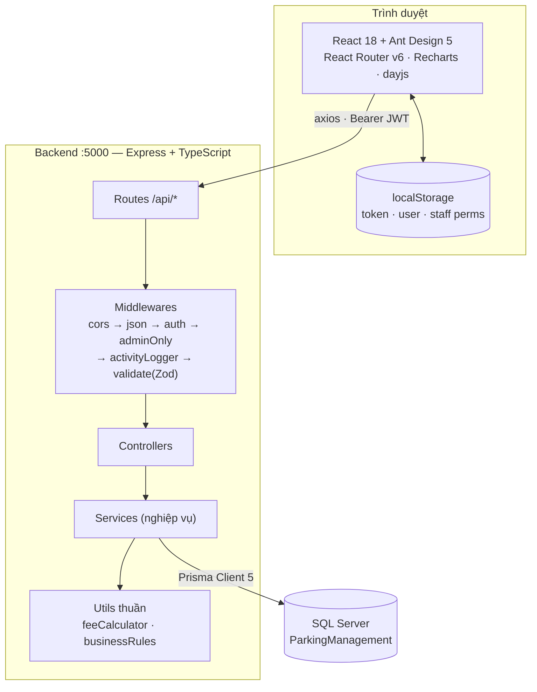
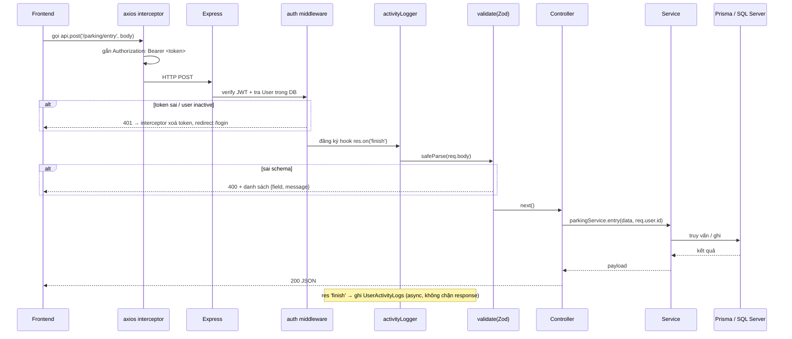
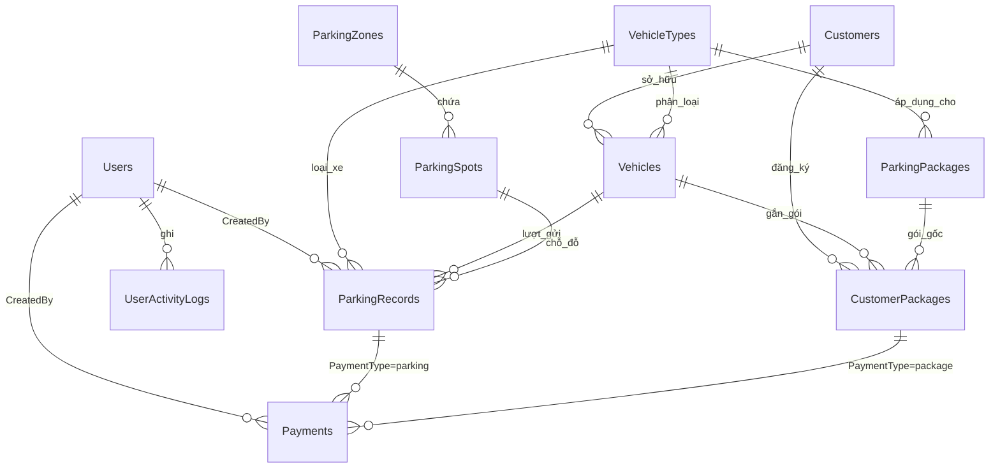
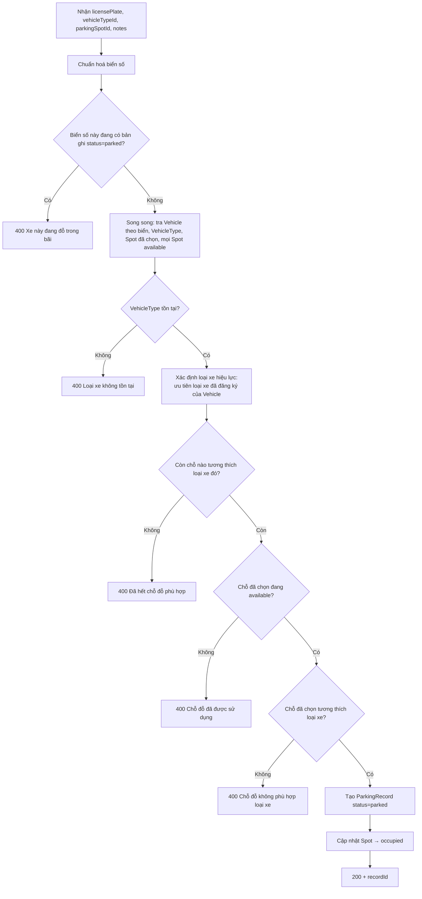
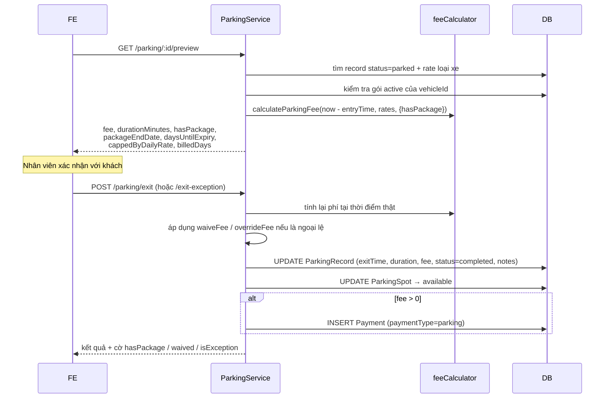
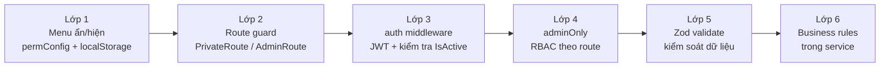

# QLBDX — Kiến trúc chi tiết hệ thống

> Tài liệu này mô tả **kiến trúc hiện tại** (as-is) của hệ thống Quản lý bãi đỗ xe QLBDX,
> từ mức tổng quan xuống tới từng module, từng bảng dữ liệu, từng luồng nghiệp vụ và từng endpoint API.
> Cập nhật: 2026-08-26 — dựa trên source tại `D:\QLBDX_REVIEW\QLBDX`.

---

## Mục lục

1. [Tổng quan hệ thống](#1-tổng-quan-hệ-thống)
2. [Kiến trúc tổng thể](#2-kiến-trúc-tổng-thể)
3. [Cấu trúc thư mục](#3-cấu-trúc-thư-mục)
4. [Tầng Backend](#4-tầng-backend)
5. [Mô hình dữ liệu](#5-mô-hình-dữ-liệu)
6. [Danh mục API đầy đủ](#6-danh-mục-api-đầy-đủ)
7. [Nghiệp vụ lõi](#7-nghiệp-vụ-lõi)
8. [Tầng Frontend](#8-tầng-frontend)
9. [Bảo mật & phân quyền](#9-bảo-mật--phân-quyền)
10. [Báo cáo & cảnh báo](#10-báo-cáo--cảnh-báo)
11. [Vận hành: chạy, seed, build](#11-vận-hành-chạy-seed-build)
12. [Đánh giá & rủi ro kỹ thuật](#12-đánh-giá--rủi-ro-kỹ-thuật)

---

## 1. Tổng quan hệ thống

**QLBDX** là hệ thống quản lý bãi đỗ xe cho một cơ sở đơn lẻ (single-tenant), phục vụ hai vai trò:

| Vai trò | Mô tả | Phạm vi |
|---|---|---|
| `admin` | Quản trị viên | Toàn quyền: danh mục, người dùng, báo cáo, thanh toán, nhật ký |
| `staff` | Nhân viên vận hành | Xe vào / xe ra / khách hàng / phương tiện / đăng ký gói |

**Bốn nhóm nghiệp vụ chính:**

1. **Vận hành ra vào** — ghi nhận xe vào, xe ra, tính phí, checkout ngoại lệ, tra cứu lịch sử.
2. **Quản lý danh mục** — loại xe, khu vực, chỗ đỗ, gói dịch vụ.
3. **Quản lý khách hàng** — khách hàng, phương tiện, đăng ký gói theo xe.
4. **Quản trị & phân tích** — thanh toán, báo cáo doanh thu, cảnh báo, nhật ký hoạt động, người dùng.

**Quy mô code:**

| Thành phần | Số file | Ghi chú |
|---|---|---|
| Backend services | 17 | ~3,980 dòng (gồm `analytics.service.ts`, `alertSettings.service.ts`, `alertRuleTier.service.ts`) |
| Backend controllers | 16 | mỏng, chỉ điều phối |
| Backend routes | 16 + index | khai báo URL + middleware chain |
| Backend validators | 11 | Zod schema |
| Frontend pages | 18 | ~6,300 dòng (gồm `Analytics.tsx`) |
| Prisma models | 11 | SQL Server |
| Seed data | 1 | ~800 dòng, dữ liệu nhiều năm |

---

## 2. Kiến trúc tổng thể

### 2.1 Sơ đồ tầng



### 2.2 Nguyên tắc kiến trúc đang áp dụng

| Nguyên tắc | Hiện trạng |
|---|---|
| **Layered architecture** | route → controller → service → Prisma. Controller không chứa nghiệp vụ. |
| **Validation ở biên** | Toàn bộ body được Zod parse trước khi vào controller; `req.body` được thay bằng data đã parse. |
| **Pure function cho tính toán** | `feeCalculator.ts`, `businessRules.ts` không phụ thuộc DB → test được độc lập (`npm test`). |
| **Stateless auth** | JWT 24h, không session server-side; mỗi request re-verify user trong DB. |
| **Audit tự động** | Middleware `activityLogger(entity)` gắn vào route ghi (POST/PUT/PATCH/DELETE), log sau khi response `finish`. |
| **Singleton service** | Mỗi service export sẵn 1 instance (`export const xService = new XService()`). |

### 2.3 Vòng đời một request ghi dữ liệu



---

## 3. Cấu trúc thư mục

```
QLBDX/
├── backend/
│   ├── prisma/
│   │   ├── schema.prisma          # 11 model, provider sqlserver
│   │   └── seed.ts                # dữ liệu demo nhiều năm, idempotent (upsert)
│   ├── src/
│   │   ├── server.ts              # entry: cors + json + /api + listen
│   │   ├── config/
│   │   │   ├── index.ts           # đọc .env: port, jwtSecret, jwtExpiresIn
│   │   │   └── prisma.ts          # PrismaClient singleton
│   │   ├── routes/                # 13 router + index.ts gộp
│   │   ├── controllers/           # 13 controller (thin)
│   │   ├── services/              # 13 service (nghiệp vụ)
│   │   ├── middlewares/
│   │   │   ├── auth.ts            # auth (JWT) + adminOnly (RBAC)
│   │   │   ├── validate.ts        # validate(body) + validateQuery
│   │   │   └── activityLogger.ts  # audit log tự động
│   │   ├── validators/            # 10 Zod schema file
│   │   └── utils/
│   │       ├── feeCalculator.ts       # thuật toán tính phí (pure)
│   │       ├── feeCalculator.test.ts  # test runner tự viết
│   │       └── businessRules.ts       # chuẩn hoá biển số, tương thích chỗ đỗ, vòng đời gói
│   └── package.json
├── frontend/
│   ├── src/
│   │   ├── App.tsx                # ConfigProvider theme (đọc từ useAntdTheme) + Routes + guard
│   │   ├── api/axios.ts           # baseURL + interceptor token / 401
│   │   ├── context/
│   │   │   ├── AuthContext.tsx        # user, login, logout, loading
│   │   │   ├── LanguageContext.tsx    # vi / en
│   │   │   └── ThemeContext.tsx       # theme sáng/tối, lưu localStorage, set data-theme trên <html>
│   │   ├── theme/useAntdTheme.ts  # derive AntD ConfigProvider theme từ CSS custom properties
│   │   ├── i18n/translations.ts
│   │   ├── components/
│   │   │   ├── Layout/MainLayout.tsx        # menu động theo quyền, nút toggle theme
│   │   │   ├── Layout/DesktopOnlyBanner.tsx # cảnh báo khi viewport < 1024px
│   │   │   └── ImportModal.tsx        # import Excel (xlsx / exceljs)
│   │   ├── pages/                 # 18 màn hình
│   │   ├── utils/
│   │   │   ├── permConfig.ts      # cấu hình quyền staff (localStorage)
│   │   │   └── reportExport.ts    # xuất Excel báo cáo
│   │   ├── types/index.ts
│   │   └── design-system.css
│   └── package.json
├── database/                      # schema.sql, setup.sql, patch demo
├── start.bat / start-fast.bat     # script khởi động Windows
├── Function.md                    # đặc tả chức năng
├── KIEN_TRUC_TONG_QUAN.md         # bản kiến trúc tóm tắt (đã có)
└── KIEN_TRUC_CHI_TIET.md          # ← tài liệu này
```

---

## 4. Tầng Backend

### 4.1 Entry point — `backend/src/server.ts`

```ts
app.use(cors());          // mở cho mọi origin
app.use(express.json());
app.use('/api', routes);  // toàn bộ API dưới prefix /api
app.listen(config.port);  // mặc định 5000
```

Không có global error handler — mỗi controller tự `try/catch` và map lỗi dạng `{ status, message }` do service ném ra.

### 4.2 Cấu hình — `config/index.ts`

| Biến | Nguồn | Mặc định |
|---|---|---|
| `port` | `PORT` | `5000` |
| `jwtSecret` | `JWT_SECRET` | `default-secret-change-me` |
| `jwtExpiresIn` | `JWT_EXPIRES_IN` | `24h` |
| `DATABASE_URL` | `.env` | `sqlserver://localhost:1433;database=ParkingManagement;...` |

### 4.3 Middleware chain

**`auth`** — bắt buộc cho gần như mọi endpoint (trừ `POST /api/auth/login`):

1. Đọc header `Authorization: Bearer <token>`; thiếu → `401 "Không có token xác thực"`.
2. `jwt.verify` bằng `config.jwtSecret`; sai → `401 "Token không hợp lệ"`.
3. **Tra lại User trong DB** theo `decoded.id` → nếu không tồn tại hoặc `isActive = false` → `401 "Tài khoản không còn hiệu lực"`.
   *(Đây là điểm quan trọng: khoá tài khoản có hiệu lực ngay, không cần chờ token hết hạn.)*
4. Gắn `req.user = { id, username, role, fullName }`.

**`adminOnly`** — chặn nếu `req.user.role !== 'admin'` → `403`.

**`activityLogger(entity)`** — đăng ký hook `res.on('finish')`:
- Map method → action: `POST→CREATE`, `PUT|PATCH→UPDATE`, `DELETE→DELETE`. Method khác (GET) bị bỏ qua.
- Bỏ qua nếu `statusCode >= 400` (chỉ log thao tác thành công).
- Ghi `userId, username, action, entity, entityId (từ req.params.id), ipAddress (x-forwarded-for → socket), statusCode`.
- Chạy **sau** khi response đã gửi → không ảnh hưởng latency.

**`validate(schema)` / `validateQuery(schema)`** — Zod `safeParse`; lỗi trả `400` kèm mảng `{ field, message }`. `validate` **ghi đè `req.body`** bằng data đã parse (đã coerce/strip).

### 4.4 Thứ tự middleware chuẩn trên route ghi

```ts
router.post('/', auth, adminOnly, activityLogger('Users'), validate(createUserSchema), handler)
//              ↑ ai      ↑ quyền   ↑ audit                ↑ dữ liệu
```

Lưu ý: `activityLogger` đứng **trước** `validate`, nhưng vì chỉ log khi `statusCode < 400` nên request bị Zod chặn (400) vẫn không bị ghi log.

---

## 5. Mô hình dữ liệu

### 5.1 Sơ đồ quan hệ



### 5.2 Chi tiết từng bảng

#### `Users` — tài khoản hệ thống
| Cột | Kiểu | Ghi chú |
|---|---|---|
| `Id` | int PK | |
| `Username` | nvarchar(50) **unique** | |
| `PasswordHash` | nvarchar(255) | bcrypt, salt rounds = 10 |
| `FullName`, `Email`, `Phone` | nvarchar | Email không unique ở DB, chỉ check ở service |
| `Role` | nvarchar(20) | `admin` \| `staff`, default `staff` |
| `IsActive` | bit | `false` → chặn login **và** chặn mọi request đang có token |

#### `Customers` — khách hàng
`FullName`, `Phone` (bắt buộc), `Email`, `Address`, `IdentityCard`, `IsActive`.
Khách `IsActive = false` không được đăng ký gói mới.

#### `VehicleTypes` — danh mục loại xe *(bảng giá)*
`Name`, `Description`, `HourlyRate`, `DailyRate`, `MonthlyRate` — tất cả `Decimal(10,2)`.
Đây là **nguồn giá duy nhất** cho tính phí gửi lẻ.

#### `Vehicles` — phương tiện
`CustomerId` → `Customers`, `VehicleTypeId` → `VehicleTypes`, `LicensePlate` **unique**, `Brand`, `Model`, `Color`.

#### `ParkingZones` / `ParkingSpots` — hạ tầng bãi
- Zone: `Name`, `Description`, `TotalSpots`.
- Spot: `ZoneId`, `SpotNumber`, `SpotType` (default `standard`), `Status` (`available` \| `occupied`).
- **Unique `(ZoneId, SpotNumber)`** — không trùng số chỗ trong cùng khu.

#### `ParkingPackages` — gói dịch vụ (catalog)
`Name`, `VehicleTypeId`, `DurationDays`, `Price`, `Description`, `IsActive`.
Gói gắn cứng với một loại xe → chỉ xe cùng loại mới đăng ký được.

#### `CustomerPackages` — đăng ký gói theo xe
`CustomerId`, `PackageId`, `VehicleId`, `StartDate` (date), `EndDate` (date), `Status`.
`Status` lưu trong DB: `active` \| `expired` \| `cancelled`, nhưng khi trả về API thì **được tính lại runtime** (xem §7.3).

#### `ParkingRecords` — lượt gửi xe *(bảng trung tâm)*
| Cột | Ghi chú |
|---|---|
| `VehicleId` | **nullable** — cho phép xe vãng lai chưa đăng ký |
| `LicensePlate` | luôn lưu **dạng đã chuẩn hoá** (bỏ `-`, `.`, khoảng trắng, viết hoa) |
| `VehicleTypeId` | bắt buộc — dùng để tra giá khi xe ra |
| `ParkingSpotId` | nullable |
| `EntryTime` / `ExitTime` | `ExitTime` null khi đang đỗ |
| `Duration` | phút, tính khi xe ra (`ceil`) |
| `Fee` | `Decimal(10,2)`, tính khi xe ra |
| `Status` | `parked` \| `completed` |
| `Notes` | **kênh lưu ngoại lệ**: tiền tố `[NGOAI_LE:<reason>]` |
| `CreatedBy` | user ghi nhận |

#### `Payments` — giao dịch thu tiền
`ParkingRecordId` **hoặc** `CustomerPackageId` (một trong hai), `Amount`, `PaymentMethod` (`cash`/`card`/`transfer`), `PaymentType` (`parking`/`package`), `Status` (default `completed`), `PaidAt`, `CreatedBy`, `Notes`.

#### `UserActivityLogs` — nhật ký
`UserId`, `Username`, `Action`, `Entity`, `EntityId`, `Details`, `IpAddress`, `StatusCode`, `CreatedAt`.

### 5.3 Quy ước Prisma trong dự án

- Toàn bộ field map sang **PascalCase** của SQL Server bằng `@map` — code TS dùng camelCase, DB giữ tên gốc.
- Mọi FK đều `onDelete: NoAction, onUpdate: NoAction` → **SQL Server không cascade**; ràng buộc xoá được service kiểm tra thủ công trước khi `delete`.
- `Decimal` trả về là `Prisma.Decimal` → mọi nơi tính toán đều phải `Number(...)`.

---

## 6. Danh mục API đầy đủ

Prefix: `http://localhost:5000/api`. Cột **Quyền**: `–` = public, `auth` = mọi user đã đăng nhập, `admin` = chỉ admin.

### 6.1 Auth — `/auth`
| Method | Path | Quyền | Mô tả |
|---|---|---|---|
| POST | `/login` | – | Đăng nhập bằng **username hoặc email** → `{ token, user }` |
| POST | `/register` | admin | Tạo tài khoản `staff` |
| GET | `/me` | auth | Hồ sơ user hiện tại |
| PUT | `/me` | auth | Cập nhật hồ sơ / đổi mật khẩu |

### 6.2 Parking — `/parking` *(nghiệp vụ lõi)*
| Method | Path | Quyền | Mô tả |
|---|---|---|---|
| GET | `/` | auth | Danh sách xe (mặc định `status=parked`); filter `search, zoneId, vehicleTypeId, from, to` |
| GET | `/history` | auth | Lịch sử lượt đã hoàn tất |
| GET | `/plate-history/:plate` | auth | Tra cứu theo biển số (tối đa 100 bản ghi, kèm thống kê) |
| GET | `/:id/preview` | auth | **Xem trước phí trước khi xác nhận xe ra** |
| POST | `/entry` | auth | Ghi nhận xe vào |
| POST | `/exit` | auth | Ghi nhận xe ra + thu phí |
| POST | `/exit-exception` | auth | Checkout ngoại lệ (mất vé, miễn phí, ép giải phóng…) |

### 6.3 Danh mục & nghiệp vụ
| Nhóm | GET list | GET one | POST | PUT | DELETE | Ghi chú |
|---|---|---|---|---|---|---|
| `/customers` | auth | auth | auth | auth | **admin** | staff được thêm/sửa, chỉ admin xoá |
| `/vehicles` | auth | auth | auth | auth | **admin** | thêm `GET /by-plate/:plate` |
| `/vehicle-types` | auth | – | admin | admin | admin | |
| `/packages` | auth | – | admin | admin | admin | catalog gói |
| `/customer-packages` | auth | – | **auth** | admin | admin | staff đăng ký được; thêm `GET /check/:vehicleId` |
| `/parking-zones` | auth | – | admin | admin | admin | |
| `/parking-spots` | auth | – | admin | admin | admin | |

### 6.4 Quản trị
| Method | Path | Quyền | Mô tả |
|---|---|---|---|
| GET/POST/PUT/DELETE | `/users`, `/users/:id` | admin | CRUD tài khoản |
| GET | `/payments` | admin | Danh sách giao dịch |
| GET | `/payments/my-shift` | auth | Giao dịch trong ca của user hiện tại |
| PUT | `/payments/:id` | admin | **Sửa giao dịch** (amount, paymentMethod, notes) — có `activityLogger('Payments')` |
| GET | `/activity-logs` | admin | Nhật ký hoạt động |
| GET | `/reports/dashboard` | admin | KPI tổng quan |
| GET | `/reports/alerts` | admin | Cảnh báo tổng hợp |
| GET | `/reports/revenue` | admin | Doanh thu theo `day` \| `month` \| `year` |
| GET | `/reports/vehicle-stats` | admin | Thống kê theo loại xe |
| GET | `/reports/hourly-stats` | admin | Lưu lượng 24 giờ |
| GET | `/reports/payment-methods` | admin | Theo phương thức & loại thu |
| GET | `/reports/exception-stats` | admin | Thống kê checkout ngoại lệ |
| GET | `/analytics/insights` | admin | Phân tích occupancy/doanh thu theo khu vực + gợi ý vận hành (trang `Analytics.tsx`) |
| GET | `/alert-settings` | auth | Đọc ngưỡng cấu hình cảnh báo (mọi user đã đăng nhập, để tô màu thời gian đỗ ở trang Xe ra) |
| PUT | `/alert-settings` | admin | Cập nhật ngưỡng cảnh báo |
| GET | `/alert-rule-tiers`, `/alert-rule-tiers/rule-types` | auth | Đọc cấu hình mức độ cảnh báo theo bậc |
| POST/PUT/DELETE | `/alert-rule-tiers` | admin | CRUD cấu hình mức độ cảnh báo |

---

## 7. Nghiệp vụ lõi

### 7.1 Thuật toán tính phí — `utils/feeCalculator.ts`

Hàm thuần, không chạm DB, có test riêng (`npm test`).

```
durationHours = ceil(durationMs / 3_600_000)

if hasActivePackage        → fee = 0
if durationHours <= 0      → fee = 0
if durationHours <= 24     → fee = min(durationHours × hourlyRate, dailyRate)
                             cappedByDailyRate = (durationHours × hourlyRate > dailyRate)
if durationHours >  24     → billedDays = ceil(durationHours / 24)
                             fee = billedDays × dailyRate
```

**Trả về:** `{ durationMs, durationMinutes, durationHours, fee, billedDays, cappedByDailyRate }`
— `cappedByDailyRate` và `billedDays` được frontend dùng để giải thích cho khách vì sao ra con số đó.

**Ví dụ** (ô tô con: hourly 20.000, daily 150.000):

| Thời gian gửi | Giờ (làm tròn lên) | Phí | Ghi chú |
|---|---|---|---|
| 45 phút | 1 | 20.000 | |
| 5h10' | 6 | 120.000 | |
| 9 giờ | 9 | **150.000** | chạm trần ngày (`cappedByDailyRate`) |
| 30 giờ | 30 | 300.000 | `billedDays = 2` |
| bất kỳ, có gói | – | **0** | |

### 7.2 Luồng xe vào — `POST /parking/entry`



**Điểm đáng chú ý:**
- Xe **chưa đăng ký vẫn vào được** — `vehicleId = null`, hệ thống dùng `vehicleTypeId` người dùng chọn.
- Nếu xe **đã đăng ký**, loại xe lấy theo hồ sơ xe (`vehicle.vehicleTypeId`), **ghi đè** lựa chọn của nhân viên → tránh nhân viên chọn nhầm loại rẻ hơn.
- Biển số luôn lưu dạng chuẩn hoá → `29A-123.45`, `29a 12345`, `29A12345` là **cùng một xe**.

### 7.3 Tương thích chỗ đỗ — `utils/businessRules.ts`

Hệ thống suy ra "hạng chỗ" và "hạng xe" từ **văn bản** (tên khu, mô tả, số chỗ, spotType / tên loại xe), sau khi bỏ dấu tiếng Việt và lowercase:

| Hạng | Từ khoá nhận diện (chỗ đỗ) | Từ khoá nhận diện (loại xe) |
|---|---|---|
| `any` | chứa `vip`, hoặc không khớp gì | không khớp gì |
| `two-wheel` | `xe may`, `motor`, bắt đầu `khu a` / `a` | `xe may`, `motor`, `xe dap`, `bicycle` |
| `car` | `o to con`, `o to`, `car`, bắt đầu `khu b` / `b` | `o to`, `car` |
| `large-car` | `o to lon`, `xe tai`, `bus`, bắt đầu `khu c` / `c` | `o to lon`, `xe tai`, `bus` |

Quy tắc: `any` khớp với tất cả; ngược lại phải **trùng hạng**.

> ⚠️ Đây là heuristic dựa trên chuỗi ký tự, không phải ràng buộc dữ liệu. Đổi tên khu (ví dụ "Khu D") sẽ làm chỗ rơi về `any`.

### 7.4 Luồng xe ra — `POST /parking/exit` và `/exit-exception`

Cả hai dùng chung hàm private `completeExit()`:



**Thứ tự ưu tiên khi quyết định phí cuối:**

1. `waiveFee = true` **hoặc** `exceptionReason = 'fee_waiver'` → `fee = 0`
2. `overrideFee` là số hữu hạn → `fee = max(0, overrideFee)`
3. Còn lại → `fee` từ `calculateParkingFee` (đã tính cả miễn phí do có gói)

**Năm loại ngoại lệ** (`exceptionReason`):

| Mã | Nhãn |
|---|---|
| `lost_ticket` | Mất vé / mất phiếu |
| `damaged_ticket` | Vé hỏng / không quét được |
| `force_release` | Giải phóng chỗ bắt buộc |
| `fee_waiver` | Miễn giảm phí (ngoại lệ) → tự động fee = 0 |
| `other` | Lý do khác |

Ngoại lệ được ghi vào `ParkingRecords.Notes` theo định dạng:

```
[NGOAI_LE:lost_ticket] Mất vé / mất phiếu — <ghi chú bắt buộc của nhân viên>
```

Notes được **nối thêm** vào notes cũ (`\n`) và cắt còn 500 ký tự. Payment tương ứng cũng mang note "Checkout ngoại lệ: …".

> Đây là thiết kế **audit theo convention chuỗi**: báo cáo `/reports/exception-stats` parse ngược bằng regex `\[NGOAI_LE:([^\]]+)\]`. Không có cột riêng cho lý do ngoại lệ.

### 7.5 Vòng đời gói dịch vụ

**Đăng ký (`POST /customer-packages`)** — 6 điều kiện phải thoả:

1. Khách hàng tồn tại và `isActive = true`
2. Phương tiện tồn tại
3. Phương tiện **thuộc đúng khách hàng** đã chọn
4. Gói tồn tại và `isActive = true`
5. `vehicle.vehicleTypeId === package.vehicleTypeId` (loại xe khớp gói)
6. **Không chồng thời gian** với gói khác của cùng xe (trừ gói `cancelled`)

`endDate = startDate + package.durationDays`, set `23:59:59.999`.

**Trạng thái** được xử lý hai lớp:

| Lớp | Cơ chế |
|---|---|
| **Đồng bộ DB** | `syncExpiredStatuses()` chạy đầu mỗi `findAll`/`create`: `updateMany` các gói `active`/`pending` có `endDate < now` → `expired` |
| **Tính runtime** | `getPackageLifecycleStatus(status, start, end, now)` — `cancelled` giữ nguyên; `end < hôm nay` → `expired`; `start > hôm nay` → `pending`; còn lại → `active`. Filter theo status áp dụng **sau** khi tính lại. |

**Miễn phí khi xe ra** — `hasActivePackage(vehicleId)`: tồn tại `CustomerPackage` với `status != 'cancelled'` và `startDate <= hôm nay <= endDate`.

---

## 8. Tầng Frontend

### 8.1 Bootstrap

```
ThemeProvider                 (sáng / tối, data-theme trên <html>)
  └─ LanguageProvider         (vi / en)
      └─ ConfigProvider       (Ant Design theme từ useAntdTheme + locale viVN/enUS)
          └─ AuthProvider     (user, login, logout, loading)
              └─ BrowserRouter
                  └─ Routes
```

**Theme tokens**: `App.tsx` gọi `useAntdTheme(mode)` (`frontend/src/theme/useAntdTheme.ts`) để dựng `ThemeConfig` cho `ConfigProvider` — token màu (`colorPrimary`, `colorBgBase`, `colorText`...) không còn hardcode mà đọc trực tiếp từ CSS custom properties của `design-system.css` qua `getComputedStyle`, nên khi `ThemeContext` đổi `data-theme` (sáng/tối), theme AntD tự đồng bộ theo. Ngoài màu, còn có font Inter, `borderRadius 8`, `controlHeight 40`, cùng override cho Card / Table / Button / Input / Select / Modal / Menu.

> Trước đây `ConfigProvider` khai báo một bộ hex cứng riêng, tách biệt với CSS — dễ bị lệch màu khi design-system.css đổi token (ví dụ `colorBgBase` từng giữ `#f9f9ff` dù CSS đã đổi `--surface` sang giá trị khác). `useAntdTheme` xoá bỏ nguồn trùng lặp đó.

### 8.2 Định tuyến & bảo vệ route

| Guard | Hành vi |
|---|---|
| `PrivateRoute` | `loading` → render null; không có user → `<Navigate to="/login" />` |
| `AdminRoute` | thêm điều kiện `role === 'admin'`, sai → về `/` |

| Route | Component | Guard |
|---|---|---|
| `/login` | Login | – |
| `/` | Dashboard | Private |
| `/parking/entry` `/parking/exit` `/parking/history` | ParkingEntry / ParkingExit / ParkingHistory | Private |
| `/customers` `/vehicles` `/vehicle-types` `/parking-spots` `/packages` `/customer-packages` `/profile` | tương ứng | Private |
| `/payments` `/alerts` `/users` `/reports` `/activity-logs` | tương ứng | **Admin** |

### 8.3 Lớp gọi API — `api/axios.ts`

- `baseURL: 'http://localhost:5000/api'` — **hardcode**, không đọc env.
- Request interceptor: tự gắn `Authorization: Bearer <localStorage.token>`.
- Response interceptor: `401` **không phải** request `/auth/login` → xoá `token` + `user`, `window.location.href = '/login'`.
  *(Loại trừ login để form đăng nhập hiển thị được lỗi sai mật khẩu thay vì bị reload.)*

### 8.4 AuthContext

- Khởi tạo `user` lazy từ `localStorage` → không nháy màn hình khi F5.
- `useEffect` khi mount: nếu có token → `GET /auth/me` để xác thực lại; lỗi → dọn localStorage.
- `loading` chặn render guard cho tới khi xác thực xong.

### 8.5 Phân quyền màn hình phía client — `utils/permConfig.ts`

15 màn hình được khai báo với `adminLevel` (luôn `full`), `defaultStaffLevel` (`full` / `view` / `hidden`) và `configurable`.

| Nhóm | Màn hình staff mặc định `full` | `view` | `hidden` |
|---|---|---|---|
| Chung / Ra-Vào | Tổng quan, Xe vào, Xe ra, Lịch sử đỗ xe | | |
| Hạ tầng | | Bãi đỗ xe | |
| Nghiệp vụ | Khách hàng, Phương tiện, Đăng ký gói | | |
| Danh mục | | Loại xe, Gói dịch vụ | |
| Quản trị | | | Thanh toán, Cảnh báo, Báo cáo |
| Hệ thống | | | Người dùng, Nhật ký *(không cấu hình được)* |

Lưu tại `localStorage['qlbdx_staff_perms_v1']`. `MainLayout` đọc và dựng menu động; lắng nghe event `storage` để đồng bộ giữa các tab.

> ⚠️ **Đây chỉ là ẩn/hiện menu ở client.** Quyền thật nằm ở `adminOnly` trên backend. Cấu hình này lưu trong localStorage của **từng trình duyệt**, không đồng bộ server.

### 8.6 Danh sách màn hình

| Màn hình | Dòng | Chức năng chính |
|---|---|---|
| `Dashboard.tsx` | 611 | KPI, biểu đồ nhanh, tình trạng bãi |
| `Reports.tsx` | 754 | 6 nhóm báo cáo + xuất Excel |
| `Analytics.tsx` | 146 | Phân tích occupancy/doanh thu theo khu vực theo kỳ (tháng/quý/năm) + gợi ý vận hành, gọi `GET /analytics/insights` |
| `CustomerPackages.tsx` | 571 | Đăng ký gói, lọc đa tiêu chí |
| `ParkingExit.tsx` | 552 | Preview phí, xác nhận ra, checkout ngoại lệ, in phiếu |
| `ActivityLogs.tsx` | 439 | Tra cứu nhật ký |
| `ParkingSpots.tsx` | 412 | Sơ đồ / quản lý chỗ đỗ |
| `Users.tsx` | 388 | CRUD user + bảng cấu hình quyền staff |
| `Alerts.tsx` | 312 | Trung tâm cảnh báo |
| `Vehicles.tsx` | 304 | CRUD phương tiện |
| `Packages.tsx` | 289 | Catalog gói |
| `ParkingEntry.tsx` | 275 | Tra biển số → chọn chỗ → ghi nhận vào |
| `ParkingHistory.tsx` | 262 | Lịch sử lượt gửi |
| `Customers.tsx` | 232 | CRUD khách hàng |
| `VehicleTypes.tsx` | 176 | Bảng giá |
| `Payments.tsx` | 173+ | Danh sách giao dịch + **sửa giao dịch** (amount, phương thức, ghi chú) qua modal, gọi `PUT /payments/:id` |
| `Profile.tsx` | 133 | Hồ sơ cá nhân, đổi mật khẩu |
| `Login.tsx` | 89 | Đăng nhập |

**Tiện ích dùng chung:** `ImportModal.tsx` (import Excel qua `xlsx`/`exceljs`), `reportExport.ts` (xuất báo cáo), `i18n/translations.ts` (song ngữ vi/en), `DesktopOnlyBanner.tsx` (cảnh báo khi viewport < 1024px, ứng dụng chưa responsive đầy đủ).

### 8.7 Dark mode

- `ThemeContext.tsx` cung cấp `{ mode, toggleMode }`; `mode` mặc định `light`, đọc/ghi `localStorage['qlbdx_theme_mode']`.
- Áp dụng bằng `useLayoutEffect` (không phải `useEffect`) để set `data-theme` lên `<html>` **đồng bộ** trước khi trình duyệt paint — tránh nháy theme cũ ở lần render đầu và tránh việc `ConfigProvider` đọc `getComputedStyle` bị lệch một nhịp so với theme vừa đổi.
- `design-system.css` định nghĩa toàn bộ token màu dạng CSS custom property, override lại dưới `:root[data-theme='dark']`.
- `useAntdTheme.ts` đọc các custom property đó bằng `getComputedStyle` để dựng `ThemeConfig` cho Ant Design — một nguồn màu duy nhất cho cả CSS thuần và component AntD.
- Nút chuyển đổi theme (icon mặt trăng/mặt trời) nằm trên header `MainLayout.tsx`.
- ESLint có rule cảnh báo (`warn`) khi hardcode mã màu hex trong `frontend/src/**/*.tsx` (khai báo trong `eslintConfig.overrides` của `frontend/package.json`) — khuyến khích dùng CSS custom property thay vì hex cứng, để không phá dark mode.

---

## 9. Bảo mật & phân quyền

### 9.1 Các lớp kiểm soát



Lớp 1–2 chỉ là **trải nghiệm người dùng**. Lớp 3–6 mới là bảo mật thực sự.

### 9.2 Xác thực

- Mật khẩu: bcrypt, `genSalt(10)`.
- Login chấp nhận **username hoặc email**, chỉ với user `isActive = true`.
- Thông báo lỗi login đồng nhất (`"Tên đăng nhập hoặc mật khẩu không đúng"`) → không lộ tài khoản nào tồn tại.
- JWT payload: `{ id, username, role, fullName }`, hạn 24h.
- Mỗi request đều re-query User → **revoke tức thì** khi khoá tài khoản hoặc đổi role.

### 9.3 Audit trail

- `UserActivityLogs` ghi tự động mọi thao tác ghi thành công lên các entity: `Users, Customers, Vehicles, VehicleTypes, ParkingPackages, CustomerPackages, ParkingZones, ParkingSpots, ParkingRecords`.
- Ghi cả `ipAddress` (ưu tiên `x-forwarded-for`) và `statusCode`.
- Ngoại lệ checkout có audit thứ hai: chuỗi `[NGOAI_LE:...]` trong `Notes` + note trên `Payment`.

---

## 10. Báo cáo & cảnh báo

### 10.1 `/reports/dashboard`

Chạy 5 truy vấn song song (`Promise.all`): số xe đang đỗ, `groupBy` trạng thái chỗ, lượt vào hôm nay, `aggregate` doanh thu hôm nay, doanh thu tháng này.
Trả: `currentlyParked, totalSpots, availableSpots, occupiedSpots, todayEntries, todayRevenue, monthRevenue`.

### 10.2 `/reports/revenue`

Lấy toàn bộ `Payment` trong khoảng rồi **gom nhóm bằng JavaScript** (`Map`) theo `day` / `month` / `year`.
Mỗi kỳ trả: `totalRevenue, totalTransactions, parkingRevenue, packageRevenue`.

> Lý do gom nhóm ở tầng ứng dụng: Prisma không hỗ trợ format ngày trong `groupBy`. Đánh đổi: toàn bộ payment trong khoảng bị nạp vào RAM.

### 10.3 Các báo cáo còn lại

| Endpoint | Cách tính |
|---|---|
| `vehicle-stats` | Đếm lượt + tổng phí theo tên loại xe; mặc định phạm vi **tháng hiện tại** nếu không truyền `from`/`to` |
| `hourly-stats` | Đếm `EntryTime` theo giờ `0–23`, luôn trả đủ 24 dòng (giờ trống = 0); mặc định **hôm nay** |
| `payment-methods` | Gom theo `paymentMethod` (Tiền mặt/Thẻ/Chuyển khoản) và `paymentType` (Gửi lẻ/Gói dịch vụ), có nhãn tiếng Việt |
| `exception-stats` | Lọc `Notes contains '[NGOAI_LE:'`, parse regex lấy `reasonKey`, gom theo lý do; trả `totalCount, totalFeeImpact, waivedCount, byReason[], records[]` |

### 10.4 `/reports/alerts` — 6 nguồn cảnh báo

Chạy song song 6 truy vấn:

| # | Nguồn | Điều kiện | Giới hạn |
|---|---|---|---|
| 1 | Gói sắp hết hạn | `status=active`, `endDate` trong 7 ngày tới | 12 |
| 2 | Gói không nhất quán | `status=active` nhưng `endDate < hôm nay` **hoặc** `startDate > hôm nay` | 12 |
| 3 | Khu vực đầy / gần đầy | Duyệt zone + trạng thái spots | – |
| 4 | Xe đỗ quá lâu | `status=parked`, `entryTime <= now - 24h` (ngưỡng tham số hoá) | 20 |
| 5 | Chỗ đỗ "ma" | Spot `occupied` nhưng **không có** ParkingRecord `parked` nào | 20 |
| 6 | Thanh toán bất thường | `amount <= 0`, hoặc `>= 5.000.000`, hoặc `paymentType=parking && amount >= 300.000` | 20 |

Kết quả gộp thành mảng alert thống nhất: `{ id, severity, category, title, description, occurredAt, relatedPath }` — `relatedPath` cho phép click thẳng sang màn hình xử lý.

### 10.5 `/analytics/insights` — Phân tích & gợi ý (trang `Analytics.tsx`)

`analytics.service.ts` → `getInsights(period)` (`month` \| `quarter` \| `year`) trả về phân tích theo ngày trong tuần, theo khung giờ, và **hiệu quả theo khu vực** (`zoneEfficiency`): số chỗ, doanh thu, tỷ lệ lấp đầy, doanh thu/chỗ — kèm danh sách gợi ý vận hành dạng text (ví dụ đề xuất tăng occupancy khu vực dùng ít).

> **Đã sửa lỗi tính occupancy theo khu vực:** trước đây tỷ lệ lấp đầy tính từ trạng thái **hiện tại** của `ParkingSpot` (`status = occupied`), nên không phản ánh đúng kỳ báo cáo đã chọn — ví dụ xem báo cáo tháng trước vẫn ra "100% occupied, 0đ doanh thu" nếu đúng lúc gọi API các chỗ đang trống. Cách tính hiện tại là **time-weighted overlap**: với mỗi `ParkingRecord`, lấy phần giao giữa `[entryTime, exitTime]` và khoảng `[start, end]` của kỳ báo cáo, cộng dồn theo khu vực, rồi chia cho `tổng số chỗ × độ dài kỳ` để ra tỷ lệ lấp đầy đúng nghĩa cho đúng khoảng thời gian được lọc.

---

## 11. Vận hành: chạy, seed, build

### 11.1 Yêu cầu

- Node.js 18+
- SQL Server (mặc định `localhost:1433`, DB `ParkingManagement`)

### 11.2 Chạy nhanh (Windows)

```bash
start.bat
```

Script tự động: cài dependencies nếu thiếu → `prisma generate` → kill process cũ trên cổng 3000/5000 → mở backend (`npm run dev`) và frontend (`npm start`) ở cửa sổ riêng → poll `localhost:3000` tối đa 90 lần × 2s → mở trình duyệt khi sẵn sàng.

### 11.3 Chạy thủ công

```bash
cd backend && npm install && npx prisma generate && npm run dev
```

```bash
cd frontend && npm install && npm start
```

### 11.4 Lệnh backend

| Lệnh | Tác dụng |
|---|---|
| `npm run dev` | `ts-node-dev` hot reload |
| `npm run build` | `tsc` → `dist/` |
| `npm start` | chạy bản build |
| `npm run prisma:generate` | sinh Prisma Client |
| `npm run prisma:migrate` | migrate dev |
| `npm run prisma:studio` | GUI xem DB |
| `npm run prisma:seed` | nạp dữ liệu demo |
| `npm test` | chạy test `feeCalculator` |

### 11.5 Dữ liệu seed

`prisma/seed.ts` (799 dòng) — **idempotent** nhờ `upsert`, chạy lại nhiều lần an toàn. Sinh dữ liệu trải nhiều năm để báo cáo có số liệu thật.

**Tài khoản demo:**

| Username | Mật khẩu | Role | Trạng thái |
|---|---|---|---|
| `admin` | `admin123` | admin | active |
| `giamdoc` | *(xem seed)* | admin | active — demo nhiều admin |
| `nhanvien1` | `staff123` | staff | active |
| `nhanvien2` | `staff123` | staff | active |
| `nhanvien3` | `staff123` | staff | **inactive** — demo khoá tài khoản |

### 11.6 Cổng & thư mục SQL

| Thành phần | Cổng |
|---|---|
| Frontend | 3000 |
| Backend | 5000 |
| SQL Server | 1433 |

`database/` chứa `schema.sql`, `setup.sql`, `demo_business_patch.sql`, `update-admin-password.sql` cho ai muốn dựng DB bằng SQL thuần thay vì Prisma.

---

## 12. Đánh giá & rủi ro kỹ thuật

### 12.1 Điểm mạnh

- **Phân tầng sạch** — controller mỏng, nghiệp vụ tập trung trong service, dễ đọc và dễ bảo trì.
- **Logic tính phí là pure function có test** — thay đổi công thức không sợ vỡ ngầm.
- **Validate tập trung bằng Zod** — không có kiểm tra kiểu rải rác trong controller.
- **Audit log tự động** — chỉ cần gắn thêm middleware khi có entity mới.
- **`isActive` kiểm tra mỗi request** — khoá tài khoản có hiệu lực ngay.
- **Ràng buộc nghiệp vụ đầy đủ ở gói dịch vụ** — 6 lớp kiểm tra chống đăng ký sai/chồng.
- **Chuẩn hoá biển số nhất quán** — tránh trùng lặp do định dạng nhập liệu.

### 12.2 Rủi ro & nợ kỹ thuật

| # | Vấn đề | Vị trí | Ảnh hưởng |
|---|---|---|---|
| 1 | **Nạp toàn bộ bảng vào RAM để so khớp biển số** | `parking.service.ts` → `findVehicleByNormalizedPlate` gọi `vehicle.findMany()` không điều kiện; `entry()` cũng `findMany` toàn bộ record `parked` | Chậm dần khi dữ liệu lớn. Cách sửa: lưu thêm cột `NormalizedPlate` có index. |
| 2 | **Xe vào / xe ra không chạy trong transaction** | `entry()`, `completeExit()` — nhiều lệnh `update`/`create` tuần tự | Lỗi giữa chừng → chỗ đỗ hoặc thanh toán lệch trạng thái. Đây chính là nguồn của cảnh báo "chỗ đỗ ma". |
| 3 | **Race condition khi giành chỗ đỗ** | Kiểm tra `status === 'available'` rồi mới `update` | Hai nhân viên đặt cùng chỗ cùng lúc → ghi đè nhau. Cần transaction + điều kiện update. |
| 4 | **Ngoại lệ lưu bằng chuỗi trong `Notes`** | `[NGOAI_LE:reason]`, parse ngược bằng regex | Dữ liệu không có cấu trúc, không index được, dễ hỏng nếu nhân viên sửa notes. Nên tách cột/bảng riêng. |
| 5 | **Tương thích chỗ đỗ dựa trên heuristic chuỗi** | `businessRules.ts` → `getSpotCategory` khớp cả `startsWith('a')`, `startsWith('b')`… | Đặt tên khu mới hoặc số chỗ bắt đầu bằng chữ khác sẽ rơi về `any`, mất kiểm soát. Nên có cột phân hạng tường minh. |
| 6 | **Báo cáo gom nhóm trong RAM** | `report.service.ts` — `getRevenue`, `getVehicleStats`… `findMany` rồi `Map` | Khoảng thời gian rộng → tốn bộ nhớ, chậm. Nên dùng `$queryRaw` với `GROUP BY`. |
| 7 | **Không có phân trang ở API list** | Hầu hết `findAll` trả toàn bộ | Bảng lớn sẽ nặng cả server lẫn trình duyệt. |
| 8 | **`baseURL` hardcode `http://localhost:5000/api`** | `frontend/src/api/axios.ts` | Không deploy được nếu không sửa code. Nên dùng `REACT_APP_API_URL`. |
| 9 | **Secret mặc định yếu** | `.env` đang là `JWT_SECRET=your-secret-key`; fallback `default-secret-change-me` | Bắt buộc đổi trước khi lên môi trường thật. |
| 10 | **`cors()` mở toàn bộ origin** | `server.ts` | Cần giới hạn origin ở production. |
| 11 | **Token lưu trong `localStorage`** | `AuthContext` | Nhạy cảm với XSS. Cân nhắc httpOnly cookie. |
| 12 | **Cấu hình quyền staff nằm ở localStorage** | `permConfig.ts` | Mỗi trình duyệt một cấu hình, admin đổi ở máy này máy khác không thấy. Nên đưa xuống DB. |
| 13 | **Không có global error handler** | `server.ts` | Lỗi ngoài dự kiến trong controller có thể rò stack trace hoặc treo request. |
| 14 | **Test chỉ phủ `feeCalculator`** | `utils/feeCalculator.test.ts` | Các luồng entry/exit/gói chưa có test tự động. |
| 15 | **`Decimal` phải `Number()` thủ công khắp nơi** | mọi service | Rủi ro sai số nếu quên; số tiền lớn có thể mất chính xác. |

### 12.3 Thứ tự ưu tiên khắc phục đề xuất

1. **Bọc transaction** cho `entry()` và `completeExit()` — sửa gốc rủi ro #2, #3, giảm cảnh báo "chỗ đỗ ma".
2. **Thêm cột `NormalizedPlate` + index** — sửa #1, cải thiện hiệu năng rõ rệt.
3. **Đưa `baseURL` và `JWT_SECRET` ra biến môi trường** — điều kiện cần để deploy (#8, #9, #10).
4. **Phân trang cho các API list lớn** (`/parking/history`, `/activity-logs`, `/payments`) — #7.
5. **Tách lý do ngoại lệ thành cột riêng**, giữ `Notes` cho ghi chú tự do — #4.
6. **Chuyển aggregate báo cáo xuống SQL** — #6.
7. **Đưa cấu hình quyền staff xuống DB** kèm API — #12.

---

## Phụ lục A — Bảng tra nhanh trạng thái

| Thực thể | Trường | Giá trị hợp lệ |
|---|---|---|
| `Users` | `Role` | `admin`, `staff` |
| `Users` | `IsActive` | `true`, `false` |
| `ParkingSpots` | `Status` | `available`, `occupied` |
| `ParkingSpots` | `SpotType` | `standard` (mặc định), tuỳ biến |
| `ParkingRecords` | `Status` | `parked`, `completed` |
| `CustomerPackages` | `Status` (DB) | `active`, `expired`, `cancelled` |
| `CustomerPackages` | Status (runtime) | `active`, `expired`, `pending`, `cancelled` |
| `Payments` | `PaymentMethod` | `cash`, `card`, `transfer` |
| `Payments` | `PaymentType` | `parking`, `package` |
| `Payments` | `Status` | `completed` |
| `UserActivityLogs` | `Action` | `CREATE`, `UPDATE`, `DELETE` |
| Ngoại lệ checkout | `exceptionReason` | `lost_ticket`, `damaged_ticket`, `force_release`, `fee_waiver`, `other` |

## Phụ lục B — Bản đồ file theo nghiệp vụ

| Muốn sửa… | Đọc file |
|---|---|
| Công thức tính phí | `backend/src/utils/feeCalculator.ts` |
| Quy tắc chỗ đỗ / biển số / vòng đời gói | `backend/src/utils/businessRules.ts` |
| Luồng xe vào / xe ra / ngoại lệ | `backend/src/services/parking.service.ts` |
| Điều kiện đăng ký gói | `backend/src/services/customerPackage.service.ts` |
| Nội dung báo cáo & cảnh báo | `backend/src/services/report.service.ts` |
| Đăng nhập / JWT | `backend/src/services/auth.service.ts` + `middlewares/auth.ts` |
| Quyền truy cập endpoint | `backend/src/routes/*.routes.ts` |
| Cấu trúc dữ liệu | `backend/prisma/schema.prisma` |
| Menu & quyền màn hình | `frontend/src/utils/permConfig.ts` + `components/Layout/MainLayout.tsx` |
| Theme giao diện (màu sắc, token) | `frontend/src/design-system.css` (nguồn duy nhất) + `frontend/src/theme/useAntdTheme.ts` (đọc vào AntD) |
| Dark mode / toggle sáng-tối | `frontend/src/context/ThemeContext.tsx` + `components/Layout/MainLayout.tsx` |
| Sửa giao dịch thanh toán | `backend/src/services/payment.service.ts` (`update`) + `frontend/src/pages/Payments.tsx` |
| Tính occupancy theo khu vực (báo cáo phân tích) | `backend/src/services/analytics.service.ts` (`getInsights`) |
| Gọi API / xử lý 401 | `frontend/src/api/axios.ts` |
| Song ngữ | `frontend/src/i18n/translations.ts` |
