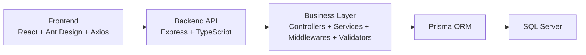
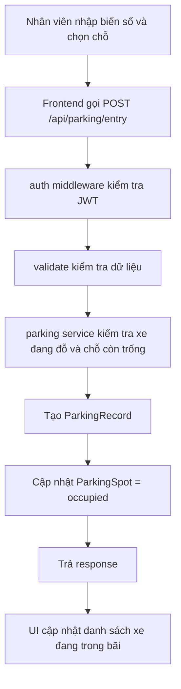
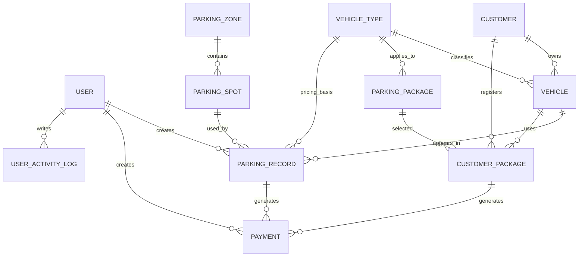

# Kiến trúc tổng quan hệ thống QLBDX

---

## 1. Giới thiệu ngắn

`QLBDX` là hệ thống quản lý bãi đỗ xe, phục vụ 2 nhóm người dùng chính:

- `admin`: quản lý cấu hình hệ thống, người dùng, báo cáo, doanh thu, danh mục.
- `staff`: vận hành hằng ngày như ghi nhận xe vào, xe ra, tra cứu khách hàng, phương tiện, đăng ký gói cho khách.

Nói ngắn gọn: đây là một hệ thống CRUD + nghiệp vụ vận hành bãi đỗ xe. Ngoài các màn hình quản lý dữ liệu, hệ thống có các luồng nghiệp vụ quan trọng như:

- ghi nhận xe vào bãi,
- ghi nhận xe ra và tính phí,
- đăng ký gói dịch vụ theo xe,
- quản lý chỗ đỗ và theo dõi trạng thái bãi.

Ví dụ rất đời thường: nhân viên nhập biển số `29A12345`, chọn loại xe và chỗ đỗ, bấm "Ghi nhận xe vào". Khi khách ra, nhân viên mở màn hình xe ra, chọn bản ghi đang đỗ, hệ thống tự tính phí hoặc miễn phí nếu xe còn gói.

---

## 2. Kiến trúc tổng quan

### Sơ đồ kiến trúc



### Giải thích từng tầng

#### 2.1 Frontend: React

Frontend nằm ở `frontend/src`. Đây là phần người dùng nhìn thấy: các trang đăng nhập, dashboard, xe vào, xe ra, khách hàng, phương tiện, gói dịch vụ...

Vai trò của frontend:

- hiển thị giao diện,
- thu dữ liệu người dùng nhập,
- gọi API sang backend bằng `axios`,
- nhận response rồi cập nhật UI.

Ví dụ: ở trang `ParkingEntry.tsx`, nhân viên nhập biển số, frontend gọi API tra cứu xe theo biển số, sau đó gọi tiếp API ghi nhận xe vào.

#### 2.2 Backend API: Express + TypeScript

Backend nằm ở `backend/src`. Nó nhận request từ frontend qua các route dạng `/api/...`, kiểm tra token, validate dữ liệu, gọi service xử lý nghiệp vụ rồi trả JSON về cho frontend.

Ví dụ:

- `/api/auth/login` để đăng nhập,
- `/api/parking/entry` để xe vào,
- `/api/parking/exit` để xe ra,
- `/api/customer-packages/check/:vehicleId` để kiểm tra xe có gói hay không.

#### 2.3 Business Layer: controller, service, middleware, validator

Đây là phần quan trọng nhất về mặt kiến trúc vì nó làm cho code dễ đọc và dễ bảo trì.

- `routes`: định nghĩa URL nào map vào xử lý nào.
- `controllers`: nhận request, gọi service, trả response.
- `services`: chứa nghiệp vụ chính.
- `middlewares`: chặn giữa đường, ví dụ xác thực JWT hoặc ghi log hoạt động.
- `validators`: kiểm tra dữ liệu đầu vào bằng `zod`.

Ví dụ dễ hiểu:

- controller giống "lễ tân nhận hồ sơ",
- service giống "bộ phận nghiệp vụ xử lý hồ sơ",
- Prisma giống "cầu nối xuống database".

#### 2.4 Prisma ORM

Backend không viết raw SQL cho hầu hết nghiệp vụ chính, mà dùng Prisma để thao tác dữ liệu theo kiểu object.

Ví dụ:

- `prisma.parkingRecord.create(...)` để tạo bản ghi xe vào,
- `prisma.parkingSpot.update(...)` để đổi trạng thái chỗ đỗ,
- `prisma.customerPackage.findFirst(...)` để kiểm tra gói còn hiệu lực.

Lợi ích khi trả lời phản biện:

- code gọn hơn,
- có type an toàn hơn khi viết TypeScript,
- dễ include quan hệ như `vehicle -> customer`, `parkingSpot -> zone`.

#### 2.5 SQL Server

Database dùng `SQL Server`. Prisma schema trong `backend/prisma/schema.prisma` mô tả model, cột, quan hệ, còn các script SQL thô nằm trong `database/`.

Nói ngắn gọn: SQL Server là nơi lưu dữ liệu thật, Prisma chỉ là lớp trung gian để backend làm việc thuận tiện hơn.

---

## 3. Cấu trúc thư mục chính

### 3.1 Ở mức tổng thể

```text
QLBDX/
├── backend/
├── frontend/
├── database/
├── README.md
├── Function.md
├── KIEN_TRUC_TONG_QUAN.md
├── demo_accounts.md
├── start.bat
└── start-fast.bat
```

### 3.2 `frontend/`

Các thư mục/file đáng chú ý:

- `frontend/src/api/axios.ts`: cấu hình `axios`, tự gắn JWT vào header `Authorization`.
- `frontend/src/context/AuthContext.tsx`: lưu trạng thái đăng nhập, login/logout, gọi `/auth/me`.
- `frontend/src/context/ThemeContext.tsx`: quản lý theme sáng/tối (`mode`), lưu lựa chọn vào `localStorage` (`qlbdx_theme_mode`), gắn thuộc tính `data-theme` lên `<html>`.
- `frontend/src/theme/useAntdTheme.ts`: đọc token màu từ CSS custom properties (`getComputedStyle`) để dựng theme cho Ant Design `ConfigProvider`, đảm bảo giao diện AntD và CSS tự viết luôn đồng bộ dù đang ở theme sáng hay tối.
- `frontend/src/components/Layout/MainLayout.tsx`: layout chính, menu (ẩn/hiện theo role), có nút chuyển đổi theme sáng/tối (icon mặt trăng/mặt trời) trên header.
- `frontend/src/components/Layout/DesktopOnlyBanner.tsx`: banner cảnh báo có thể đóng, hiện khi màn hình nhỏ hơn 1024px — ứng dụng là công cụ nội bộ, chưa đầu tư responsive đầy đủ.
- `frontend/src/pages/`: các màn hình nghiệp vụ.
- `frontend/src/types/index.ts`: TypeScript interfaces toàn cục.
- `frontend/src/utils/reportExport.ts`: xuất Excel (multi-sheet), CSV, in PDF báo cáo.
- `frontend/src/design-system.css`: CSS bổ sung cho dashboard, hero section, occupancy bars; có bảng màu riêng cho dark mode dưới `:root[data-theme='dark']`.

Danh sách trang hiện có (18 trang):

| Trang | Staff | Admin |
|-------|-------|-------|
| `Login.tsx` | ✓ | ✓ |
| `Dashboard.tsx` | ✓ (vận hành) | ✓ (đầy đủ KPI) |
| `ParkingEntry.tsx` | ✓ | ✓ |
| `ParkingExit.tsx` | ✓ (+ ngoại lệ) | ✓ |
| `ParkingHistory.tsx` | ✓ (+ tra biển số) | ✓ |
| `Customers.tsx` | ✓ | ✓ |
| `Vehicles.tsx` | ✓ | ✓ |
| `VehicleTypes.tsx` | xem | ✓ |
| `Packages.tsx` | xem | ✓ |
| `CustomerPackages.tsx` | ✓ | ✓ |
| `ParkingZones.tsx` | xem | ✓ |
| `ParkingSpots.tsx` | xem | ✓ |
| `Payments.tsx` | — | ✓ (xem + sửa) |
| `Reports.tsx` | — | ✓ |
| `Analytics.tsx` | — | ✓ (phân tích & gợi ý) |
| `Alerts.tsx` | — | ✓ |
| `Users.tsx` | — | ✓ |
| `ActivityLogs.tsx` | — | ✓ |

### 3.3 `backend/`

Các thư mục quan trọng:

- `backend/src/routes/`: định tuyến API.
- `backend/src/controllers/`: nhận request, trả response.
- `backend/src/services/`: xử lý nghiệp vụ.
- `backend/src/middlewares/`: `auth`, `adminOnly`, `activityLogger`, `validate`.
- `backend/src/validators/`: schema `zod`.
- `backend/src/config/`: cấu hình app và Prisma.
- `backend/src/utils/`:
  - `feeCalculator.ts`: hàm thuần `calculateParkingFee()` — logic tính phí gửi xe.
  - `feeCalculator.test.ts`: 9 unit test (0p, <1h, capped daily, qua 24h, có gói).
  - `businessRules.ts`: chuẩn hóa biển số, kiểm tra loại xe.
- `backend/prisma/schema.prisma`: mô hình dữ liệu Prisma.
- `backend/prisma/seed.ts`: seed dữ liệu demo dày cho 01–02/08/2026.

### 3.4 `database/`

- `database/setup.sql`: tạo database + schema + seed cơ bản.
- `database/demo_business_patch.sql`: sync dữ liệu demo theo rule nghiệp vụ (biển số, trạng thái gói/chỗ đỗ).

Nếu giám khảo hỏi "vậy schema thật nằm ở đâu?", có thể trả lời:

- về phía lập trình ứng dụng: xem `backend/prisma/schema.prisma`,
- về phía triển khai SQL Server thủ công: xem các file trong `database/`.

---

## 4. Luồng request điển hình

Phần này nên kể như một câu chuyện, vì lúc bảo vệ nói kiểu kể chuyện thường dễ hiểu hơn.

### Ví dụ: Staff đăng nhập rồi ghi nhận xe vào

1. Nhân viên mở frontend và nhập `username/password` ở trang đăng nhập.
2. Frontend gọi `POST /api/auth/login`.
3. Backend route `/auth/login` nhận request, `validate` kiểm tra dữ liệu đầu vào.
4. `auth.controller` gọi `auth.service.login()`.
5. Service kiểm tra user có tồn tại, còn hoạt động không, rồi so khớp mật khẩu bằng `bcryptjs`.
6. Nếu đúng, backend tạo `JWT` chứa các thông tin như `id`, `username`, `role`, `fullName`.
7. Frontend nhận token, lưu vào `localStorage`.
8. Từ request sau trở đi, `axios` interceptor tự gắn header:

   `Authorization: Bearer <token>`

9. Nhân viên sang màn hình xe vào và bấm ghi nhận.
10. Frontend gọi `POST /api/parking/entry`.
11. Backend middleware `auth` lấy token từ header, `verify` token, rồi gắn thông tin user vào `req.user`.
12. Middleware `activityLogger` chuẩn bị ghi log nếu request thành công.
13. Middleware `validate(parkingEntrySchema)` kiểm tra dữ liệu như biển số, loại xe, chỗ đỗ.
14. `parking.controller.entry()` gọi `parking.service.entry(...)`.
15. Service kiểm tra:

    - xe này có đang ở trong bãi chưa,
    - bãi có đang đầy không,
    - chỗ đỗ được chọn có còn `available` không,
    - xe đã tồn tại trong hệ thống chưa.

16. Nếu hợp lệ, service tạo `ParkingRecord`.
17. Nếu có chọn chỗ đỗ, service cập nhật `ParkingSpot.status = occupied`.
18. Backend trả JSON thành công cho frontend.
19. Frontend hiện thông báo "Ghi nhận xe vào thành công" và tải lại danh sách xe đang đỗ.

### Nói ngắn gọn một câu

Frontend chỉ lo giao diện và gửi request. Backend mới là nơi kiểm tra quyền, validate dữ liệu, xử lý nghiệp vụ và thao tác database.

---

## 5. Luồng nghiệp vụ cốt lõi

### 5.1 Luồng xe vào



Diễn giải:

1. Nhân viên nhập biển số, chọn loại xe, chọn chỗ đỗ.
2. Hệ thống có thể tra trước thông tin xe theo biển số để biết chủ xe là ai.
3. Backend kiểm tra xe có đang đỗ rồi không. Nếu rồi thì từ chối, tránh ghi nhận trùng.
4. Backend kiểm tra bãi còn chỗ không.
5. Nếu nhân viên chọn một chỗ cụ thể, backend kiểm tra chỗ đó còn `available`.
6. Backend tạo bản ghi `ParkingRecord`.
7. Nếu có `parkingSpotId`, backend đổi trạng thái chỗ đó thành `occupied`.

Ví dụ cụ thể:

- biển số: `29A12345`
- loại xe: `Ô tô con`
- chỗ đỗ: `Khu B - B12`

Sau khi thành công:

- bảng `ParkingRecords` có thêm 1 dòng,
- bảng `ParkingSpots` của chỗ `B12` chuyển sang `occupied`.

### 5.2 Luồng xe ra (thông thường)

1. Nhân viên mở màn hình xe ra, chọn một xe đang có trạng thái `parked`.
2. Frontend gọi `GET /api/parking/:id/preview` để xem trước phí.
3. Backend lấy `entryTime`, so với thời điểm hiện tại để tính thời gian gửi xe.
4. Hệ thống kiểm tra xe đó có gói dịch vụ đang còn hiệu lực không.
5. Nếu có gói thì phí = `0`.
6. Nếu không có gói (logic trong `feeCalculator.ts`):

   - trong vòng 24 giờ: `min(số giờ × giá giờ, giá ngày)`
   - quá 24 giờ: `số_ngày × giá_ngày + min(giờ_lẻ × giá_giờ, giá_ngày)`

7. Backend cập nhật `ParkingRecord`: `exitTime`, `duration`, `fee`, `status = completed`.
8. Nếu có chỗ đỗ, backend trả chỗ về `available`.
9. Nếu phí > 0, backend tạo thêm một bản ghi `Payment`.
10. Frontend hiển thị số tiền để nhân viên thu và có thể in biên nhận.

Ví dụ cụ thể:

- xe vào lúc `08:10`, ra lúc `10:05` (gần 2 giờ)
- giá giờ `10.000`, giá ngày `60.000`
- phí = `min(2 × 10.000, 60.000) = 20.000`

### 5.3 Luồng xe ra ngoại lệ (checkout ngoại lệ)

Đây là luồng mới bổ sung cho tình huống thực tế như mất vé, miễn phí VIP, ghi đè phí.

1. Nhân viên bật switch "Checkout ngoại lệ" trong màn hình xe ra.
2. Nhân viên chọn lý do: `Mất vé`, `Miễn phí`, `Khác`...
3. Nhân viên có thể nhập ghi chú, bật "Miễn phí" hoặc nhập "Phí ghi đè".
4. Frontend gọi `POST /api/parking/exit-exception`.
5. Backend kiểm tra bản ghi tồn tại và đang `parked`.
6. Backend lưu `exceptionReason`, `exceptionNote`, `waiveFee`, phí ghi đè vào `ParkingRecord`.
7. Tạo `Payment` nếu phí > 0 và không bị miễn.
8. Trả `status = completed`.

Điểm hay để nói khi bảo vệ: hệ thống có audit trail đầy đủ — ngoại lệ vẫn được ghi nhận với lý do và người thực hiện, không "xóa chui" dữ liệu.

### 5.4 Tra cứu lịch sử theo biển số

Nhân viên hoặc admin có thể nhập một biển số bất kỳ vào ô tìm kiếm ở màn hình `ParkingHistory.tsx`, hệ thống gọi `GET /api/parking/plate-history/:plate` và trả về:

- Tổng số lượt gửi (tất cả thời gian).
- Xe có đang trong bãi không.
- Số lần checkout ngoại lệ.
- Danh sách toàn bộ bản ghi có thể cuộn xem.

Ứng dụng thực tế: tìm xe khả nghi đỗ lâu, kiểm tra lịch sử vi phạm, xác nhận thông tin cho khách.

### 5.5 Luồng đăng ký gói dịch vụ

1. Nhân viên hoặc admin chọn khách hàng, chọn xe, chọn gói.
2. Backend kiểm tra:

   - khách hàng còn hoạt động không,
   - xe có tồn tại không,
   - xe có thuộc khách hàng đó không,
   - loại xe có khớp với gói không,
   - gói có đang active không,
   - xe có bị chồng thời gian gói với gói khác không.

3. Backend tính `startDate` và `endDate`.
4. Tạo bản ghi `CustomerPackage`.
5. Tạo luôn một bản ghi `Payment` với `paymentType = package`.

Điểm hay để nói khi bảo vệ: gói dịch vụ không chỉ là "một dòng dữ liệu", mà còn kéo theo ràng buộc nghiệp vụ và một giao dịch thanh toán đi cùng.

---

## 6. Mô hình dữ liệu trọng yếu

### 6.1 Các entity chính

- `User`: tài khoản đăng nhập hệ thống.
- `Customer`: khách hàng gửi xe.
- `VehicleType`: loại xe, kèm bảng giá giờ/ngày/tháng.
- `Vehicle`: phương tiện cụ thể của khách hàng.
- `ParkingZone`: khu vực đỗ.
- `ParkingSpot`: chỗ đỗ cụ thể trong khu vực.
- `ParkingPackage`: gói dịch vụ.
- `CustomerPackage`: gói mà một khách/xe đã đăng ký.
- `ParkingRecord`: bản ghi xe vào - xe ra.
- `Payment`: bản ghi thanh toán.
- `UserActivityLog`: nhật ký hoạt động người dùng.

### 6.2 Quan hệ chính



### 6.3 Hiểu quan hệ theo kiểu dễ nhớ

- Một `Customer` có thể có nhiều `Vehicle`.
- Một `Vehicle` có thể vào bãi nhiều lần nên có nhiều `ParkingRecord`.
- Một `VehicleType` quyết định bảng giá, nên khi tính phí xe ra, backend dựa vào `VehicleType`.
- Một `ParkingZone` chứa nhiều `ParkingSpot`.
- Một `CustomerPackage` gắn với cả `Customer`, `Vehicle`, và `ParkingPackage`.
- Một `Payment` có thể phát sinh từ:

  - gửi xe lẻ (`parkingRecordId`)
  - hoặc mua gói (`customerPackageId`)

### 6.4 Ví dụ dữ liệu mẫu

Ví dụ một chuỗi dữ liệu có thể hình dung như sau:

- `Customer`: Nguyễn Văn A, SĐT `0901234567`
- `Vehicle`: biển số `29A12345`, loại `Ô tô con`
- `ParkingPackage`: `Gói tháng ô tô`, `durationDays = 30`, `price = 1.200.000`
- `ParkingSpot`: `B12`, khu `Khu B`
- `ParkingRecord`: xe `29A12345` vào lúc `2026-08-01 08:10`
- `Payment`: nếu không có gói thì trả phí gửi; nếu mua gói thì có payment loại `package`

---

## 7. Phân quyền

### 7.1 Admin làm gì?

Theo route hiện tại, `admin` có quyền với các phần nhạy cảm hơn:

- quản lý `users`
- xem `reports`
- xem `payments`
- xem `activity-logs`
- tạo/sửa/xóa `vehicle-types`
- tạo/sửa/xóa `parking-zones`
- tạo/sửa/xóa `parking-spots`
- tạo/sửa/xóa `packages`
- xóa `customers`, `vehicles`, `customer-packages`

### 7.2 Staff làm gì?

`staff` vẫn đăng nhập và dùng được các nghiệp vụ vận hành hằng ngày:

- xem và cập nhật hồ sơ cá nhân
- ghi nhận xe vào/ra
- xem lịch sử đỗ xe
- quản lý khách hàng
- quản lý phương tiện
- đăng ký gói dịch vụ cho khách
- tra cứu chỗ đỗ

Nói dễ hiểu: staff là người chạy nghiệp vụ hàng ngày, còn admin là người quản trị hệ thống và xem phần quản lý sâu hơn.

### 7.3 Middleware bảo vệ route thế nào?

Có 2 lớp chính:

- `auth`: kiểm tra request có JWT hợp lệ không.
- `adminOnly`: kiểm tra `req.user.role === 'admin'`.

Ví dụ:

- route `/api/reports/dashboard` dùng `auth, adminOnly`
- route `/api/parking/entry` dùng `auth`

Tức là:

- ai chưa đăng nhập thì bị chặn từ đầu,
- ai là staff mà cố gọi API admin-only thì backend vẫn chặn, dù có sửa frontend thủ công đi nữa.

### 7.4 Frontend cũng có chặn

Frontend có:

- `PrivateRoute`: chưa đăng nhập thì đẩy về `/login`
- `AdminRoute`: không phải admin thì không vào được màn hình admin

Nhưng khi trả lời phản biện nên nhấn mạnh:

> Frontend chỉ chặn ở mức trải nghiệm người dùng. Bảo mật thật vẫn phải nằm ở backend middleware.

### 7.5 Ma trận phân quyền cấu hình được (Configurable RBAC)

Ngoài phân quyền cứng ở backend, hệ thống còn có **ma trận phân quyền mềm** do admin cấu hình qua giao diện:

- Admin vào **Người dùng → tab Phân quyền chức năng**
- Với mỗi màn hình có thể cấu hình, admin chọn mức độ cho Staff: **Ẩn | Chỉ xem | Đầy đủ**
- Cấu hình lưu vào `localStorage` và được `MainLayout` đọc để ẩn/hiện menu item
- Có nút **Chỉnh sửa / Lưu / Hủy / Reset** + bulk-set nhanh "Ẩn hết / Xem hết / Đầy đủ hết"

> Lưu ý cho phản biện: đây là lớp phân quyền UI-level, không thay thế `adminOnly` middleware ở backend. Mục đích là giúp admin tùy biến giao diện cho từng bãi đỗ xe khác nhau.

**File liên quan:**
- `frontend/src/utils/permConfig.ts` — định nghĩa SCREENS, AccessLevel, load/save localStorage
- `frontend/src/pages/Users.tsx` — tab Phân quyền với Radio.Group inline
- `frontend/src/components/Layout/MainLayout.tsx` — đọc permConfig để lọc menu

---

## 8. Công nghệ và lý do chọn

Phần này nên trả lời ngắn, tự nhiên, không cần quá "sách giáo khoa".

- `React`: phù hợp làm SPA, chia component, dễ quản lý nhiều màn hình CRUD.
- `Ant Design`: có sẵn form, table, modal, layout; giúp làm giao diện quản trị nhanh.
- `Axios`: gọi API đơn giản, dễ gắn interceptor để tự thêm JWT.
- `Express`: nhẹ, dễ tổ chức route/middleware, phù hợp backend đồ án.
- `TypeScript`: giúp code rõ kiểu dữ liệu, đỡ lỗi khi code nhiều module.
- `Prisma`: thao tác DB tiện hơn raw SQL, hỗ trợ relation tốt, hợp với TypeScript.
- `SQL Server`: phù hợp bài toán dữ liệu quan hệ như khách hàng - xe - lượt gửi - thanh toán.
- `JWT`: phù hợp xác thực stateless cho frontend/backend tách rời.
- `Zod`: validate request đầu vào rõ ràng và dễ đọc.

Nếu cần nói gọn thành 1 câu:

> Nhóm chọn stack này vì cân bằng giữa dễ học, dễ phát triển CRUD, và vẫn đủ rõ kiến trúc nhiều tầng để trình bày khi bảo vệ.

---

## 9. Câu hỏi phản biện thường gặp + gợi ý trả lời

### 1. Tại sao tách `controller` và `service`?

Vì controller chỉ nên nhận/trả HTTP, còn service mới là nơi chứa nghiệp vụ. Làm vậy code dễ đọc, dễ test, và sau này đổi giao diện hay thêm API khác thì service vẫn tái sử dụng được.

### 2. Frontend gọi API ra sao?

Frontend dùng `axios` trong `frontend/src/api/axios.ts`. Sau khi đăng nhập, token được lưu vào `localStorage`, rồi request interceptor tự thêm `Authorization: Bearer ...` cho các request sau.

### 3. JWT hoạt động thế nào trong project này?

Khi login thành công, backend ký một JWT chứa `id`, `username`, `role`, `fullName`. Những request cần bảo vệ sẽ đi qua middleware `auth`; middleware này `verify` token rồi gắn thông tin user vào `req.user` để controller/service dùng tiếp.

### 4. Tại sao dùng Prisma thay vì raw SQL?

Vì Prisma giúp thao tác dữ liệu theo model TypeScript, include quan hệ thuận tiện, và code ít lỗi vặt hơn. Nói đúng bản chất thì dữ liệu vẫn nằm ở SQL Server, Prisma chỉ là lớp truy cập dữ liệu dễ dùng hơn.

### 5. Nếu 2 người cùng chọn 1 chỗ đỗ thì sao?

Hiện tại service xe vào có kiểm tra chỗ đỗ còn `available` trước khi tạo bản ghi, rồi cập nhật chỗ đó thành `occupied`. Cách này xử lý tốt đa số tình huống thường gặp, nhưng nếu 2 request đến gần như đồng thời thì vẫn có rủi ro race condition vì chưa thấy khóa transaction chặt ở mức DB cho nghiệp vụ này. Đây là một điểm có thể nêu như hướng cải tiến.

### 6. Tính phí xe ra được xử lý thế nào?

Backend lấy `entryTime`, so với thời điểm hiện tại để tính số phút/giờ. Nếu xe còn gói active thì `fee = 0`; nếu không thì tính theo giá giờ, nhưng không vượt quá giá ngày trong 24 giờ đầu. Quá 24 giờ thì tính theo số ngày.

### 7. Gói tháng/gói dịch vụ được kiểm tra thế nào?

Backend tra `CustomerPackage` theo `vehicleId`, kiểm tra trạng thái và khoảng ngày hiệu lực. Trong version hiện tại còn có phân biệt runtime status như `active`, `pending`, `expired`, `cancelled` để phản ánh đúng tình trạng gói theo ngày.

### 8. Hệ thống có soft delete không?

Có, nhưng không đồng đều cho mọi bảng. Ví dụ `User` và `Customer` có cờ `isActive`, nên thiên về vô hiệu hóa mềm. Trong khi một số bảng khác như `ParkingPackage`, `CustomerPackage`, `ParkingSpot` có chỗ đang xóa cứng nhưng phải kiểm tra hoặc dọn quan hệ liên quan trước khi xóa.

### 9. Tại sao phải chuẩn hóa biển số?

Vì người dùng có thể nhập `29A-12345`, `29A 12345`, hoặc `29A12345`. Backend có util chuẩn hóa biển số để tránh trùng logic và giảm lỗi khi tra cứu/tạo xe.

### 10. Vì sao có `activity log`?

Để biết ai đã tạo/sửa/xóa cái gì, và hỗ trợ theo dõi vận hành. Middleware `activityLogger` đang ghi lại các thao tác thành công như `CREATE`, `UPDATE`, `DELETE`; ngoài ra login thành công/thất bại cũng có log riêng.

### 11. Frontend đã chặn admin/staff rồi, sao backend còn phải chặn nữa?

Vì frontend có thể bị bypass. Người dùng có thể gọi API trực tiếp bằng Postman hoặc sửa request thủ công, nên backend mới là nơi bắt buộc phải kiểm tra quyền thật. Ngoài ra, middleware `auth` hiện tại còn re-check `role` và `isActive` từ DB mỗi request — tức là dù token vẫn còn hạn, nếu admin vô hiệu hóa tài khoản thì request tiếp theo sẽ bị chặn ngay.

### 12. Khi nào không cho sửa dữ liệu xe?

Nếu xe đang ở trong bãi thì không cho đổi biển số/chủ xe/loại xe; nếu xe đang có gói active hoặc pending thì không cho đổi loại xe. Điều này giúp dữ liệu lịch sử không bị lệch.

### 13. Checkout ngoại lệ là gì, tại sao cần?

Thực tế vận hành bãi đỗ có những tình huống không theo quy trình chuẩn: khách mất vé, xe VIP miễn phí, nhân viên ghi đè phí vì lý do đặc biệt. Nếu không có luồng ngoại lệ, nhân viên buộc phải thoát xe với phí sai hoặc xóa bản ghi. Luồng `exit-exception` cho phép ghi đúng lý do + số tiền, giữ nguyên audit trail, và không mất dữ liệu.

### 14. Hệ thống có unit test không?

Có. File `backend/src/utils/feeCalculator.test.ts` chứa 9 test cases cho hàm tính phí:
- 0 phút → 0 đồng
- Dưới 1 giờ → tính 1 giờ
- 11 giờ → bị cap bởi giá ngày
- 24 giờ chẵn → 1 ngày
- 25 giờ → 1 ngày + 1 giờ lẻ
- 48 giờ → 2 ngày
- 49 giờ → 2 ngày + 1 giờ, lại bị cap
- Có gói active → phí = 0

Chạy bằng `cd backend && npm test`.

### 15. Báo cáo xuất được những gì?

Từ trang Reports (admin only), có thể:
- **Xuất Excel** (multi-sheet): sheet Tổng quan, sheet Doanh thu theo kỳ, sheet Phân loại xe, sheet Phương thức thanh toán.
- **Xuất CSV**: riêng từng bộ dữ liệu (doanh thu / xe / thanh toán).
- **In PDF**: mở cửa sổ in với layout chuẩn gồm KPI box, bảng doanh thu, bảng loại xe, chữ ký.

### 16. Hệ thống có dark mode không?

Có. `ThemeContext` lưu `mode` (`light`/`dark`) vào `localStorage`, gắn `data-theme` lên thẻ `<html>`; `design-system.css` định nghĩa bảng màu riêng cho `:root[data-theme='dark']`. `useAntdTheme.ts` đọc lại các CSS custom property đó qua `getComputedStyle` để dựng theme cho Ant Design, nên giao diện AntD và CSS tự viết không bao giờ lệch màu nhau khi đổi theme. Nút chuyển theme (icon mặt trăng/mặt trời) nằm trên header của `MainLayout`.

### 17. Thanh toán (`Payments`) có sửa được không?

Có, admin sửa được số tiền, phương thức thanh toán và ghi chú của một giao dịch qua `PUT /api/payments/:id` (trước đây trang này chỉ xem, không sửa). Thao tác sửa vẫn đi qua middleware `activityLogger('Payments')` nên vẫn có audit trail như các thao tác ghi khác.

---

## 10. Script trình bày 2-3 phút

Có thể nói theo nhịp sau:

> Đề tài của em là hệ thống quản lý bãi đỗ xe, phục vụ hai nhóm người dùng chính là admin và nhân viên vận hành. Về mặt kiến trúc, hệ thống được tách thành frontend và backend. Frontend viết bằng React và Ant Design để làm giao diện quản trị, còn backend dùng Express và TypeScript để cung cấp API xử lý nghiệp vụ.
>
> Luồng hoạt động chung là frontend gửi request lên backend qua các API `/api/...`. Backend đi qua các lớp route, middleware, controller và service. Middleware kiểm tra JWT và validate dữ liệu. Controller nhận request và trả response, còn service là nơi xử lý nghiệp vụ chính như xe vào, xe ra, tính phí, đăng ký gói.
>
> Ở tầng dữ liệu, backend dùng Prisma để làm việc với SQL Server. Các bảng quan trọng gồm khách hàng, phương tiện, loại xe, khu vực đỗ, chỗ đỗ, bản ghi gửi xe, gói dịch vụ và thanh toán. Ví dụ một khách hàng có thể có nhiều xe, một xe có thể có nhiều lượt gửi, và một lượt gửi có thể phát sinh thanh toán khi xe ra.
>
> Về luồng nghiệp vụ: xe vào là nhân viên nhập biển số, chọn loại xe và chỗ đỗ, backend kiểm tra xe chưa trong bãi và chỗ còn trống, rồi tạo bản ghi. Xe ra thì backend tính phí — nếu xe có gói thì miễn, không có gói thì lấy min(giờ × giá, giá ngày) trong 24h đầu, quá 24h thì tính theo ngày. Logic này nằm trong hàm riêng `calculateParkingFee` và có 9 unit test để chứng minh tính đúng đắn.
>
> Ngoài ra hệ thống còn có luồng checkout ngoại lệ cho tình huống thực tế như mất vé hay miễn phí VIP; trang cảnh báo phát hiện bất thường như xe đỗ quá lâu hay khu sắp đầy; và trang báo cáo có thể xuất Excel nhiều sheet, CSV, hoặc in PDF trực tiếp.
>
> Điểm em muốn nhấn mạnh là hệ thống không chỉ là CRUD — có ràng buộc nghiệp vụ rõ ràng, phân quyền theo role, kiểm tra gói còn hiệu lực, ghi log hoạt động, và thuật toán tính phí được unit test đầy đủ.

---

## 11. Năm ý nên học kỹ trước khi bảo vệ

### 1. Luồng request từ frontend xuống database

Phải nói trơn được chuỗi:

```
React page → axios → route → middleware (auth / validate) → controller → service → Prisma → SQL Server → response → UI
```

### 2. Quan hệ dữ liệu cốt lõi

Đặc biệt là các cặp:

- `Customer → Vehicle`
- `Vehicle → ParkingRecord`
- `ParkingRecord → Payment`
- `CustomerPackage → Vehicle + ParkingPackage`
- `ParkingZone → ParkingSpot`

### 3. Hai nghiệp vụ chính: xe vào và xe ra

Nếu nói chắc 2 luồng này, gần như đã nắm được phần "linh hồn" của hệ thống. Nhớ thêm checkout ngoại lệ là điểm cộng khi bảo vệ.

### 4. Thuật toán tính phí

Ghi nhớ công thức:
- ≤ 24h: `min(giờ × hourlyRate, dailyRate)`
- > 24h: `ngày × dailyRate + min(giờ_lẻ × hourlyRate, dailyRate)`
- Có gói active → `0`

Có thể trả lời câu hỏi này bằng cách chạy `npm test` live để show 9/9 PASS.

### 5. Phân quyền và bảo mật

- JWT được verify tại middleware `auth` trên mỗi request.
- `adminOnly` chặn staff gọi API admin.
- Middleware re-check `isActive` từ DB — token cũ không bypass được nếu tài khoản đã bị vô hiệu hóa.
- Frontend ẩn menu theo role nhưng đây chỉ là UX — backend mới là lớp bảo mật thật.
